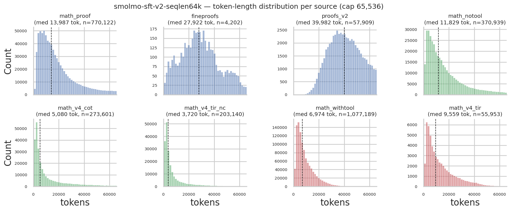
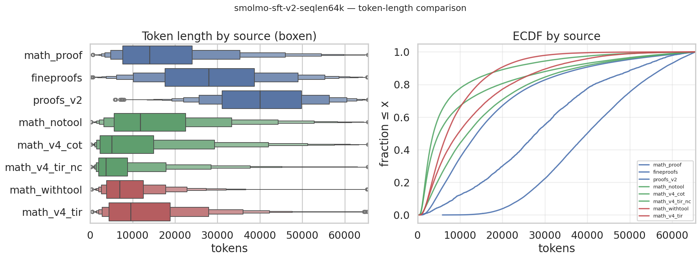

# smolmo-sft-v2-seqlen64k

A supervised fine-tuning (SFT) dataset of **math problems with full chain-of-thought solutions**,
formatted for the [**Olmo 3 "Thinking"**](https://huggingface.co/allenai/Olmo-3-7B-Think) models.

- **2,813,055 examples · ~37.9 B tokens.**
- Three task families: **proofs**, **numeric-answer problems**, and **tool-augmented (Python) problems**.
- Every assistant turn carries an explicit `<think> … </think>` reasoning trace before the answer.
- Olmo 3 native chat + function-calling format; every example fits within a **64k-token** context.

```python
from datasets import load_dataset
ds = load_dataset("chankhavu/smolmo-sft-v2-seqlen64k", split="train")
```

---

## Task families and sub-tasks

Each example is a `messages` conversation (user → assistant), with the assistant's reasoning in a
`<think> … </think>` block followed by the final answer. The three families each contain a few
distinct sub-tasks (the `task_type` column tells you which):

### 📐 Proofs  — *`math_proof`, `proofs_v2`, `fineproofs`*
Olympiad-style proof writing and grading. Sub-tasks:
- **`solution`** — write a rigorous proof of a statement (or prove the validity of a derived answer).
  Many also append a **self-evaluation** that grades their own proof.
- **`evaluation`** — given a problem and a candidate solution, score the solution's quality against a
  rubric (`0` wrong / `0.5` partially correct / `1` fully correct).
- **`analysis`** — a meta-review: given a problem, a solution, *and* an evaluation of it, judge whether
  that evaluation is reasonable. (`fineproofs` is `solution`-only.)

### 🔢 Numeric-answer  — *`math_notool`, `math_v4_cot`, `math_v4_tir_nc`*
Problems with a definite answer, solved with step-by-step reasoning and a final `\boxed{}` result.
- **`solution` / `cot`** — straight chain-of-thought to a numeric/closed-form answer.
- **`tir_nc`** ("tool-integrated reasoning, no call") — problems where a Python tool *was* offered but
  the model chose to solve it by reasoning alone. These are presented without tools (no tool prompt).
- `math_notool` additionally includes some **judge** examples (pick the best of several candidate
  solutions).

### 🛠️ Tool use  — *`math_withtool`, `math_v4_tir`*
The assistant solves by writing Python in a stateful interpreter, reading the output, and iterating.
- **`tool` / `tir`** — multi-turn solving where the assistant emits
  `stateful_python_code_exec(code=...)` calls and the interpreter's output returns in an `environment`
  turn, before the assistant continues to a final answer.
- `math_withtool` also contains some **grader/judge** examples.

> Grading sub-tasks (`evaluation`, `analysis`, judges) carry a `score_normalized` value
> (`0` / `0.5` / `1`); solution sub-tasks leave it empty.

---

## Mixture

Blended from several upstream collections and balanced to a token budget (the two largest Cascade
subsets are capped so no single source dominates), then fully shuffled. Sorted by token count:

| subset | source (upstream) | family | examples | tokens |
|---|---|---|---|---|
| `math_proof` | Nemotron-Cascade-2-SFT-Data | proofs | 770,122 | 13.9 B |
| `math_withtool` | Nemotron-Cascade-2-SFT-Data | tool use | 1,077,189 | 10.0 B |
| `math_notool` | Nemotron-Cascade-2-SFT-Data | numeric | 370,939 | 6.0 B |
| `math_v4_cot` | Nemotron-SFT-Math-v4 | numeric | 273,601 | 3.2 B |
| `proofs_v2` | Nemotron-Math-Proofs-v2 | proofs | 57,909 | 2.3 B |
| `math_v4_tir_nc` | Nemotron-SFT-Math-v4 | numeric | 203,140 | 1.6 B |
| `math_v4_tir` | Nemotron-SFT-Math-v4 | tool use | 55,953 | 0.8 B |
| `fineproofs` | FineProofs-SFT | proofs | 4,202 | 0.1 B |
| **Total** | | | **2,813,055** | **37.9 B** |

≈ 16 B tokens of proofs · 11 B numeric · 11 B tool use. 1024 shards (`data/train-XXXXX-of-01024.parquet`,
zstd), row-shuffled across all sources.

---

## Token-length distribution

Total example length (problem + reasoning + answer), per source, capped at 65,536 tokens (longer
examples were dropped).





| subset | family | examples | mean | median | 90th pct | 99th pct |
|---|---|---|---|---|---|---|
| math_proof | proofs | 770,122 | 18,038 | 13,987 | 38,872 | 61,796 |
| fineproofs | proofs | 4,202 | 28,938 | 27,922 | 51,465 | 62,641 |
| proofs_v2 | proofs | 57,909 | 40,485 | 39,982 | 57,906 | 64,665 |
| math_notool | numeric | 370,939 | 16,200 | 11,829 | 37,097 | 60,646 |
| math_v4_cot | numeric | 273,601 | 11,560 | 5,080 | 33,705 | 60,301 |
| math_v4_tir_nc | numeric | 203,140 | 7,929 | 3,720 | 21,344 | 49,697 |
| math_withtool | tool use | 1,077,189 | 9,287 | 6,974 | 19,444 | 35,017 |
| math_v4_tir | tool use | 55,953 | 13,408 | 9,559 | 30,644 | 50,839 |

*(tokens; raw values in `assets/token_stats.csv`)*

Proofs dominate the long tail — `proofs_v2` (generated by a very strong reasoning model) has a median
of ~40k tokens — while tool-use and short numeric solutions cluster at a few thousand. The 64k cap
removed ~30% of `proofs_v2` but almost none of the shorter sources.

---

## Schema

| column | description |
|---|---|
| `messages` | conversation: list of `{role, content, functions, function_calls}` turns (`functions`/`function_calls` are set only on tool examples). |
| `source` | sub-collection (the mixture table's `subset`). |
| `num_tokens` | length in tokens after formatting. |
| `task_type` | `solution` / `evaluation` / `analysis` / `notool` / `cot` / `tir` / `tir_nocall`. |
| `score_normalized` | grading score `0` / `0.5` / `1` (grading sub-tasks only). |
| `generator` | model that produced the reasoning (DeepSeek-V3.x / V4). |
| `orig_source` | upstream dataset. |
| `problem_id` | hash of the normalized problem statement (groups examples of the same problem). |
| `domain` | proof / math / tool. |

### Format

Olmo 3 Thinking native format, verified against the official model:
- Reasoning is `<think> … </think>` (note the single space after the opening tag — it aligns the
  training text with the model's inference-time generation prompt); the final answer follows.
- Tool examples declare the tool in the system message; the assistant emits
  `stateful_python_code_exec(code=...)` calls and the interpreter result returns in an `environment`
  turn.
- The matching chat template ships as `docs/chat_template.jinja` (the official
  `allenai/Olmo-3-7B-Think` template). Serve trained models with vLLM
  `--reasoning-parser olmo3 --tool-call-parser olmo3`.

Exact token boundaries, training masks, audits, and a full reproduction guide are in [`docs/`](docs/).

---

## Provenance

A curated, reformatted blend of openly-licensed math collections:

- [**Nemotron-Cascade-2-SFT-Data**](https://huggingface.co/datasets/nvidia/Nemotron-Cascade-2-SFT-Data)
  (NVIDIA) — `math_proof`, `math_notool`, `math_withtool` (DeepSeek-V3.x reasoning).
- [**Nemotron-Math-Proofs-v2**](https://huggingface.co/datasets/nvidia/Nemotron-Math-Proofs-v2)
  (NVIDIA) — `proofs_v2` (DeepSeek-V4).
- [**Nemotron-SFT-Math-v4**](https://huggingface.co/datasets/nvidia/Nemotron-SFT-Math-v4) (NVIDIA) —
  `math_v4_cot`, `math_v4_tir`, `math_v4_tir_nc` (DeepSeek-V4).
- **FineProofs-SFT** — `fineproofs`.

Processing: unified to one chat format, reasoning attached as `<think>` blocks, tool calls converted
to Olmo's native function-calling format, system prompts standardized, examples > 64k tokens dropped,
mix balanced to a token budget, fully shuffled. Each conversion was audited for faithfulness to the
source and exact agreement with the official Olmo 3 format (see [`docs/AUDITS.md`](docs/AUDITS.md));
all scripts are in [`docs/scripts/`](docs/scripts/).

The same problem may appear multiple times (different solutions, or different sources) — intentional,
so the data is **not** deduplicated by problem.

## License

CC-BY-4.0, inheriting the upstream licenses (the Nemotron sources are CC-BY-4.0). Please cite the
original datasets. Prepared for open math-reasoning research.
